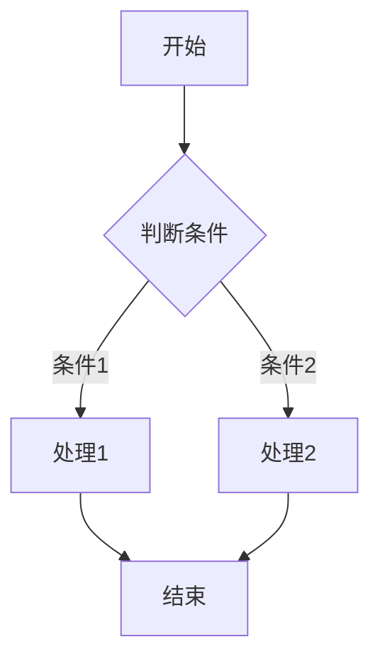

# lightAIchat
全部由Trae生成，尝试集成了让通过 ai 聊天获取到的内容更加便捷的保存和二次编辑，变成可以输出的内容
一个功能强大的AI对话工具，支持多种大语言模型，提供丰富的内容展示和管理功能。

## 功能特点

- **多模型支持**：集成DeepSeek、火山方舟、阿里千帆、硅基流动等多种AI模型服务（目前调通了DeepSeek的接口，其他接口待调试）
- **Markdown渲染**：完美支持Markdown格式，包括代码高亮显示
- **数据可视化**：支持ECharts图表生成和展示
- **流程图支持**：支持Mermaid流程图的生成和显示
- **数学公式**：支持KaTeX数学公式渲染
- **内容管理**：便捷的内容保存、编辑和管理功能
- **多种导出**：支持导出为Markdown、纯文本、HTML和PDF格式
- **文件上传**：支持上传文件与AI模型交互

## 安装与运行

### 环境要求

- Node.js 16.0+
- npm 或 yarn

### 安装步骤

1. 克隆或下载项目代码

```bash
git clone https://github.com/bebetterst/lightAIchat.git
cd AIchat
```

2. 安装依赖

```bash
npm install
# 或
yarn install
```

3. 启动开发服务器

```bash
npm run dev
# 或
yarn dev
```

4. 构建生产版本

```bash
npm run build
# 或
yarn build
```

## 使用指南

### 模型设置

1. 点击聊天界面右上角的「模型设置」按钮
2. 选择AI服务提供商（DeepSeek、火山方舟、阿里千帆等）
3. 输入API密钥和其他必要参数
4. 选择模型和调整参数（温度、最大token数等）
5. 点击「测试连接」确认设置正确
6. 保存设置

### 聊天功能

- 在左侧边栏点击「新建聊天」创建新的对话
- 在输入框中输入问题并发送
- 支持上传文件（如图片、文档等）与AI交互
- 可以复制或保存AI回复内容

### 内容管理

- 点击「保存到我的内容」将对话内容保存
- 在「我的内容」页面查看和管理所有保存的内容
- 支持编辑、删除和导出保存的内容

### 特殊语法支持

#### ECharts图表

```echarts
{
  "title": {
    "text": "示例图表"
  },
  "xAxis": {
    "type": "category",
    "data": ["Mon", "Tue", "Wed", "Thu", "Fri", "Sat", "Sun"]
  },
  "yAxis": {
    "type": "value"
  },
  "series": [{
    "data": [150, 230, 224, 218, 135, 147, 260],
    "type": "line"
  }]
}
```

#### Mermaid流程图



#### 数学公式

```
$$
E = mc^2
$$
```

## 支持的模型

- **DeepSeek**
  - deepseek-chat
  - deepseek-reasoner

- **火山方舟**
  - doubao-1-5-vision-pro-32k-250115
  - doubao-1-5-pro-256k-250115
  - deepseek-r1-250120

- **阿里千帆**
  - qwq-32b
  - deepseek-r1
  - deepseek-v3

- **硅基流动**
  - Qwen/QwQ-32B
  - deepseek-ai/DeepSeek-R1
  - deepseek-ai/DeepSeek-V3
  - internlm/internlm2_5-20b-chat

## 常见问题

### API连接失败

- 检查API密钥是否正确
- 确认API端点URL是否正确
- 检查网络连接是否正常
- 查看浏览器控制台是否有错误信息

### 内容无法保存

- 确保浏览器允许本地存储
- 检查是否有足够的存储空间

### 图表或公式无法显示

- 确保网络连接正常，能够加载外部资源
- 检查语法是否正确

## 技术栈

- Vue 3
- TypeScript
- Element Plus
- Vite
- Marked (Markdown解析)
- ECharts (图表)
- KaTeX (数学公式)
- html2pdf (PDF导出)

## 许可证

[MIT License](LICENSE)
